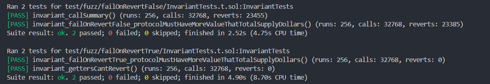
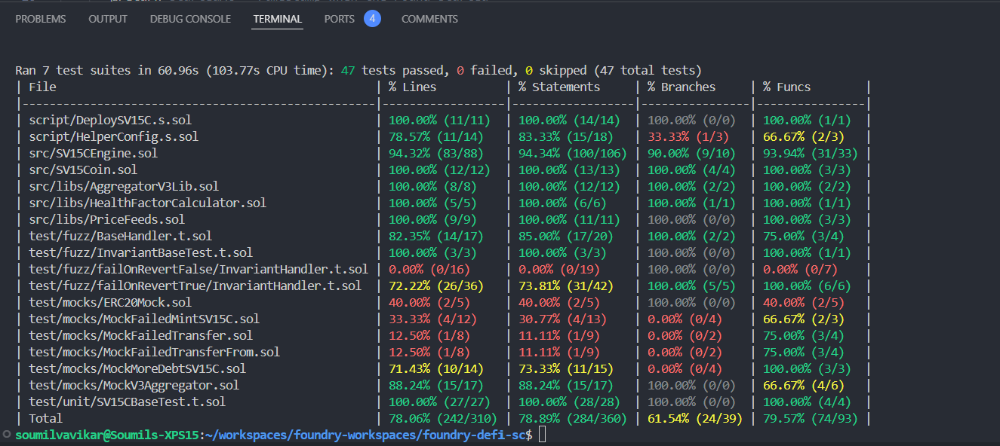
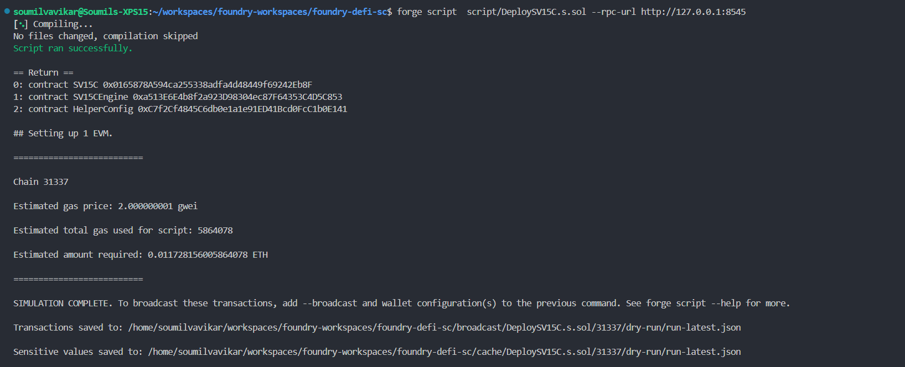
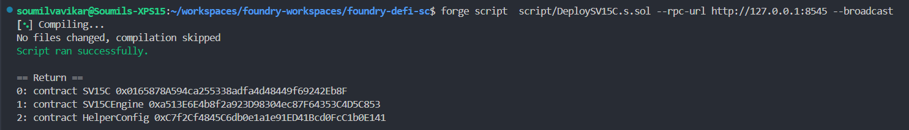
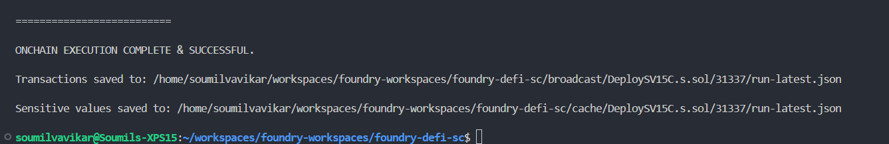
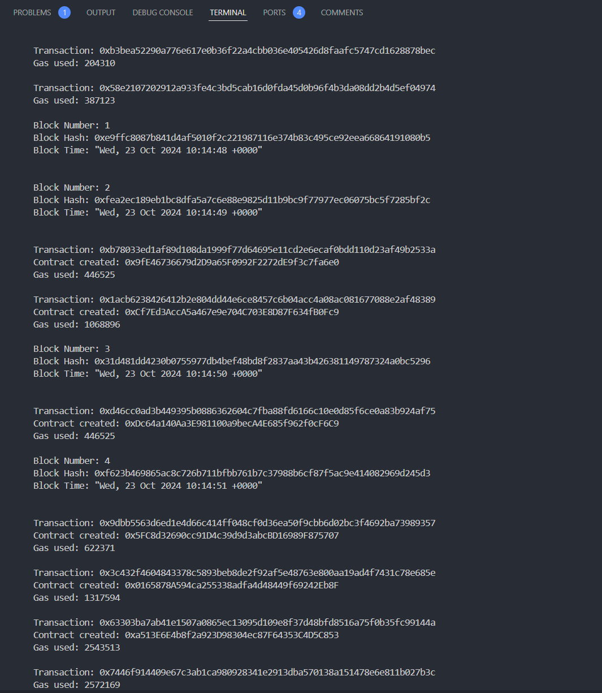

# Foundry Based sample implementation for DeFi (Stable Coin)

Before getting started with the example here, it is essential to understand what is `DeFi` or `decentralized finance`? There is a lot of content on the internet, high level summary can be found [here](readme-docs/defi.md).

## Stablecoin Architecture

- **Relative Stability**: Anchored or Pegged (1 coin = 1 USD)
  - Leverage Chainlink Pricefeed
  - Have a function to exchange ETH / BTC with USD
- **Stability Mechanism**: Algorithmic / Decentralized
  - Minting will be allowed for stablecoin with sufficient/enough collateral (coded in the smart contract)
- **Collateral**: Exogenous, we will use cryptocurrencies
  - ETH
  - BTC
  We would use the ERC21 version of ETH and BTC - wETH and wBTC

## Initial Setup

### Setup the Project Workspace

```shell
# Project initialization
forge init

# Remove all the counter.sol related files. 

# Installing Openzeppelin libraries
forge install openzeppelin/openzeppelin-contracts --no-commit
# Install the chainlink brownie contracts
forge install smartcontractkit/chainlink-brownie-contracts@1.2.0 --no-commit
```

### Add remappings to `foundry.toml`

```toml
remappings = [
    '@chainlink/contracts/=lib/chainlink-brownie-contracts/contracts/',
    '@openzeppelin/contracts=lib/openzeppelin-contracts/contracts',
]
```

## Testing

There are various types of tests we can write using foundry to test our contract and ensure that the contract functions do the intended function/work. Link to foundry test documentation is [here](https://book.getfoundry.sh/forge/tests).

- **Unit Testing**
  - Testing the code for code coverage to ensure maximum of the code is testable.
- **Function Testing**
  - Testing the functionality of the contract and ensure overall functionality/various use cases contract is expected to fulfill work as expected.
- **Fuzz Testing**
  - There are two types of Fuzz testing
    - **Stateless**
    - **Stateful**
      - Open Testing
      - Handler Based
  - Foundry leverages the keyword `**_invariant**` to do stateful fuzz testing. Hence in foundry, when we say `fuzz testing` it refers to stateless [fuzz testing](https://book.getfoundry.sh/forge/fuzz-testing) and when we say [invariant testing](https://book.getfoundry.sh/forge/invariant-testing) it refers to `stateful fuzz testing`.

  - Two Example of invariants in this usecase (there would be more in this usecase and would need to be covered if we plan to get this contract audited and deployed to mainnet)
    - The total supply of the `SV15C` should always be less than the total value of the collateral.
    - The `getter view` functions should NEVER revert. This is an evergreen invariant (should hold true for all contracts).

### Test Evidence

Below screenshots show how the Terminal window looks after successfull execution of invariant fuzzy tests.



### Command for Running Entire Test Suite

```shell
forge test

# for coverage
# We need to use the --no-match-test to not the fuzzy tests which expect the fail_on_revert in toml file as false (as its set to true)
forge coverage --no-match-test RevertFalse

#syntax
--no_match_test <regex for the tests to be skipped>
```



## Deploy the Contract to the Local Anvil Chain

```shell
# This command will simulate the deployment to the local anvil chain where we have mocked the AggregatorV3Interface, i.e. Chainlink - PriceFeed calls.
forge script  script/DeploySV15C.s.sol --rpc-url http://127.0.0.1:8545

# broadcast the contract to actually deploy
forge script  script/DeploySV15C.s.sol --rpc-url http://127.0.0.1:8545 --broadcast
```

**NOTE**: Here instead of using the vanilla anvil local chain, we can also use a forked mainnet to test in more close to actual mainnet environment.

**Deployment Simulation**:



**Deployment**:




**Logs on Anvil Local Chain**:



## Interacting with the SV15CEngine to Mint and Burn SV15C token

TBD
