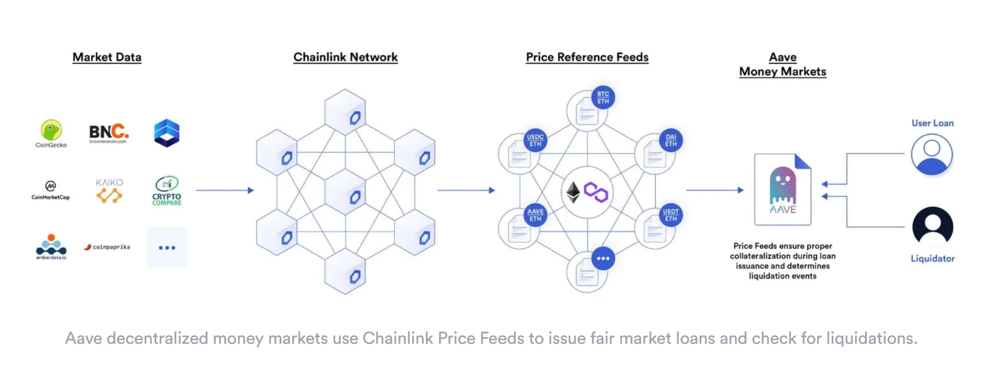

# Decentralized Finance or DeFi

## What is DeFi?

[Decentralized finance](https://chain.link/education/defi) or `DeFi` refers to the emerging blockchain-based ecosystem of permissionless and transparent financial services.

In the DeFi economy, users can access a similar financial application stack as they would in traditional finance but without requiring the involvement of centralized intermediaries. By using open-source protocols running on censorship-resistant and decentralized networks, DeFi applications provide global permissionless access, mitigate counterparty risk, and interoperate with other applications to enable more advanced financial products.

[Permissionless composability](https://chain.link/education-hub/permissionless-composability) is the design principle that is the key differentiating property between Defi and TradFi infrastructure.

- Permissionless composability in DeFi means developers can access key Web3 infrastructure without permission.

In a DeFi system:

- Users have greater confidence that their financial agreements will execute exactly as programmed (as the code is available for anyone to audit).
- Reduces development and compliance costs for developers
- Creates economic bridges, connecting what would otherwise be distinct economic segments and fostering growth.

### Stablecoins

The `sc` in the project name stands for `Stablecoins`. [Stablecoins](https://chain.link/education-hub/stablecoins) are a core DeFi component that allows fiat currencies like the U.S. dollar and other assets to be represented on the blockchain as digital tokens.

More details [here](stablecoin.md).

### Decentralized Exchanges (DEXs)

[Decentralized Exchanges](https://chain.link/education-hub/what-is-decentralized-exchange-dex) enables users to trade crypto assets through blockchain transactions without the need for a custodian or centralized intermediary.

#### Automated Market Makers (AMM)

- It is a subset of DEXs that fundamentally alters the mechanism underlying electronic exchange and is one of the most impactful innovations in decentralized finance.
AMMs, in contrast to traditional CLOBs, pre-fund both sides of the trade using `on-chain liquidity pools`.
  - These pools play a crucial role in ensuring that trades are pre-funded, a key feature of AMMs.
  - `Liquidity pools` allow users and other smart contracts to instantly swap between the tokens in the two-sided pool (e.g., the ETH/USDC pool contains ETH and USDC tokens) in a completely automated and non-custodial manner.
  - Any user can become a liquidity provider and earn passive income from trading fees from users making swaps within the pool.

### Decentralized Money Markets

[Decentralized Money Market](https://chain.link/education-hub/decentralized-money-markets) enable users to borrow and lend digital tokens using blockchain-based smart contracts in a permissionless way without custodians.

- These decentralized money marketplaces are governed by open-source code managed by a community of distributed stakeholders, democratizing the supply and demand side.
- Decentralized money markets rely on `over-collateralization,` where users must deposit more collateral than they intend to borrow.
- In decentralized money markets, oracles play a crucial role. They provide on-chain price feeds that determine users’ current collateralization ratio—the ratio of users’ collateral value to their outstanding loan value. This information is then used to issue fair market loans, liquidate undercollateralized positions, and calculate interest payments.

### Synthetic Assests

[Synthetic assets](https://blog.chain.link/unlocking-synthetic-derivatives-with-chainlink-oracles/) are financial instruments that derive their value from an underlying asset or benchmark (e.g., synthetic gold tracks the price of gold). However, with the permissionless framework of DeFi, anyone can create an open-source financial primitive that is available to the public and furnishes strong guarantees for its intended execution.

### Yield Farming

[Yield Farmin](https://chain.link/education/defi/yield-farming) is also known as `liquidity mining`, it is a new primitive neabled by DeFi that helps incentivize liquidity for a project, launching fair distribution of new tokens, and growing an active and long-lasting community.

- Yield farming incentives reward users who provide liquidity or otherwise contribute to the health of a decentralized protocol.
- The two main goals of yield farming are:
  - To incentivize users to bootstrap usage of the project.
  - To distribute newly launched tokens with governance rights over the protocol to a decentralized set of participants.

**NOTE**: All the above information is a subset of the information documented in the Chainlink documentations. Please refere to the links above to read and understand more.

### Risks Involved with DeFi

Smart contracts can unlock new economic opportunities; however, access to high-quality, tamper-proof data has historically been difficult, and no matter how robust the smart contract code is, it is highly dependent on the data it receives, this is commonly referred to as the [blockchain oracle problem](https://blog.chain.link/what-is-the-blockchain-oracle-problem/) and concerns most DeFi applications.

dApps sourcing data from premium off-chain data providers play a pivotal role in maintaining a robust and resilient DeFi ecosystem. These providers are an essential component in the fight against oracle manipulation attacks, such as flash loan attacks, and numerous other potential outlier events.

#### Flash Loan

A [flash loan](https://chain.link/education-hub/flash-loans) is a type of loan where a user borrows assets with no upfront collateral and returns the borrowed assets within the same blockchain transaction.

Hence, high-quality (off-chain) data sources that avoid manipulation are vital to protecting users and mitigating systemic risk within DeFi.

#### Maximal Extractable Value (MEV)

- MEV is a significant concept in the cryptocurrency world, particularly in relation to blockchain networks like Ethereum, it refers to the maximum value that can be extracted from block production in excess of the standard block rewards and gas fees by including, excluding, or changing the order of transactions in a block.
  - Earlier it was known as "Miner Extractable Value," the term has evolved to "Maximal Extractable Value" as it applies to both proof-of-work and proof-of-stake systems.
  - MEV presents opportunities for profit, it also raises concerns about fairness and network security. As the industry evolves, finding ways to balance MEV's impact will be crucial for the long-term health of blockchain ecosystems.

MEV has significant implications for the cryptocurrency ecosystem:

- **Fairness Issues**: It can lead to an uneven playing field where miners have an advantage over regular users.
- **Network Security**: Large MEV opportunities can incentivize blockchain forks, potentially compromising network security.
- **DeFi Vulnerability**: Decentralized finance (DeFi) protocols are particularly susceptible to MEV exploitation due to their transparent and permissionless nature.

Several approaches are being developed to mitigate MEV:

- **Fair Sequencing Services**: These aim to ensure fairness in transaction ordering.
- **Off-chain Transactions and Batching**: This reduces the importance of transaction order.
- **User Controls**: Protocols allowing users to specify maximum slippage can help limit MEV exploitation.

##### How does MEV work?

MEV extraction typically occurs through:

1. `Transaction Ordering`: Miners or validators can reorder transactions within a block to their advantage.
2. `Transaction Inclusion/Exclusion`: Miners can choose which transactions to include or exclude from a block.
3. `Inserting Own Transactions`: Miners can insert their own transactions to capitalize on profitable opportunities.

##### Common Strategies

- **Frontrunning**: Miners or bots monitor the mempool for pending transactions and execute their own transactions ahead of others to take advantage of price movements.
- **Backrunning**: This involves placing a sell order after noticing a large buy order to profit from the resulting price increase.
- **Sandwiching**: A combination of frontrunning and backrunning, where traders place orders both before and after a target transaction.

### Important Links

- Defi Llama: <https://defillama.com/>
  - This is a website which help see the current state of DeFi and look various financial products in the decentralized context.
- MEV: <https://docs.flashbots.net/new-to-mev>
  - This website has all the information on `Maximal Extractable Value` (MEV)
  