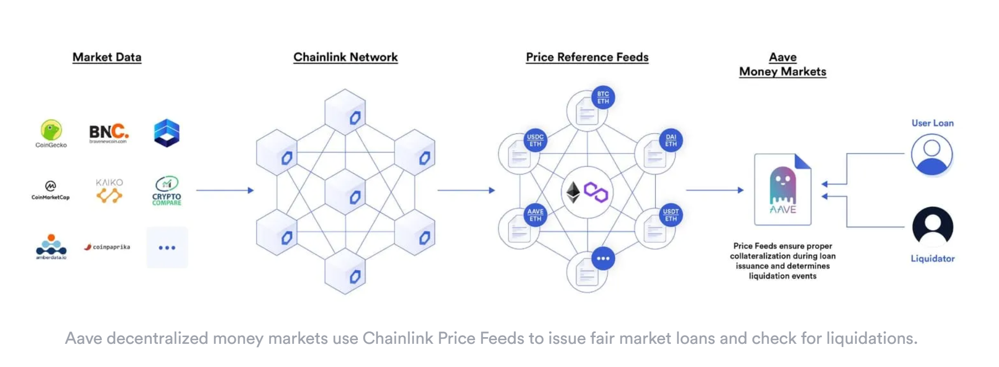

# Exchanges, Money Markets, Synthetic Assets, and Yield Farming

## Decentralized Exchanges (DEXs)

[Decentralized Exchanges](https://chain.link/education-hub/what-is-decentralized-exchange-dex) enables users to trade crypto assets through blockchain transactions without the need for a custodian or centralized intermediary.

### Automated Market Makers (AMM)

- It is a subset of DEXs that fundamentally alters the mechanism underlying electronic exchange and is one of the most impactful innovations in decentralized finance.
AMMs, in contrast to traditional CLOBs, pre-fund both sides of the trade using `on-chain liquidity pools`.
  - These pools play a crucial role in ensuring that trades are pre-funded, a key feature of AMMs.
  - `Liquidity pools` allow users and other smart contracts to instantly swap between the tokens in the two-sided pool (e.g., the ETH/USDC pool contains ETH and USDC tokens) in a completely automated and non-custodial manner.
  - Any user can become a liquidity provider and earn passive income from trading fees from users making swaps within the pool.

## Decentralized Money Markets

[Decentralized Money Market](https://chain.link/education-hub/decentralized-money-markets) enable users to borrow and lend digital tokens using blockchain-based smart contracts in a permissionless way without custodians.

- These decentralized money marketplaces are governed by open-source code managed by a community of distributed stakeholders, democratizing the supply and demand side.
- Decentralized money markets rely on `over-collateralization,` where users must deposit more collateral than they intend to borrow.
- In decentralized money markets, oracles play a crucial role. They provide on-chain price feeds that determine users’ current collateralization ratio—the ratio of users’ collateral value to their outstanding loan value. This information is then used to issue fair market loans, liquidate undercollateralized positions, and calculate interest payments.

## Synthetic Assests

[Synthetic assets](https://blog.chain.link/unlocking-synthetic-derivatives-with-chainlink-oracles/) are financial instruments that derive their value from an underlying asset or benchmark (e.g., synthetic gold tracks the price of gold). However, with the permissionless framework of DeFi, anyone can create an open-source financial primitive that is available to the public and furnishes strong guarantees for its intended execution.

## Yield Farming

[Yield Farming](https://chain.link/education/defi/yield-farming) is also known as `liquidity mining`, it is a new primitive neabled by DeFi that helps incentivize liquidity for a project, launching fair distribution of new tokens, and growing an active and long-lasting community.

- Yield farming incentives reward users who provide liquidity or otherwise contribute to the health of a decentralized protocol.
- The two main goals of yield farming are:
  - To incentivize users to bootstrap usage of the project.
  - To distribute newly launched tokens with governance rights over the protocol to a decentralized set of participants.

**NOTE**: All the above information is a subset of the information documented in the Chainlink documentations. Please refere to the links above to read and understand more.
