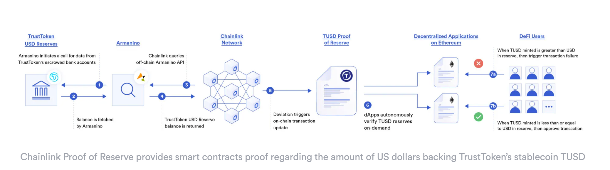

# Stable Coin

`A stablecoin is a NON-VOLATILE crypto asset.`

OR

`A stablecoin is a crypto asset whose buying power fluctuvates very less relative to the rest of the market.`

By nature, most of the crypto assets / cryptocurrencies are not stable, however, it is essential to have a stable crypto asset to perform the three critical functions of money in `Web3`:

- **Storage of value**: The way to store the money/wealth we have earned/generated.
- **Unit of account**: The way to measure how valuable something is?
- **Medium of exchange**: Accepted way to exchanging/transacting the value/products.

As of today (Oct 2024), Bitcoin and Ethereum are good storage of value or medium of exchange; however, they are not a good unit of account due to volatility. In the future, they might become stable BUT as of today, they aren't. Hence, the need for `Stablecoins`.

A stablecoin represents an underlying asset and tries to maintain a 1:1 peg with it through various mechanisms, one such example is [Fei Protocol](https://fei.money/) that operates as a `algorithimic` central bank where the peg is upheld by the protocol on the `open market` via process known as `reweighting`.

- Users can mint the stablecoin FEI with an equivalent deposit value of ETH, which gets added to the protocol’s reserves to be used as `Protocol Controlled Value` (PCV).
  - PCV represents all assets that aren’t redeemable by users.
  - If FEI is trading below the peg, PCV is used to buy FEI on the open market to push the price up.
  - If FEI is trading above the peg, more FEI is minted and sold on the open market to push the price down.

Various stablecoin designs aim to provide different guarantees for maintaining their peg, including centralized (fiat-backed) stablecoins, decentralized stablecoins, and algorithmic stablecoins.

Fiat-backed stablecoins represent fiat currency on the blockchain and are backed by off-chain collateral.

- For example, TrueUSD (TUSD) is a U.S. Dollar stablecoin backed by USD in an off-chain bank account
- It leverages Chainlink [Proof of Reserve](https://chain.link/proof-of-reserve) to present continuous on-chain audits attesting to its 1-to-1 collateralization.

